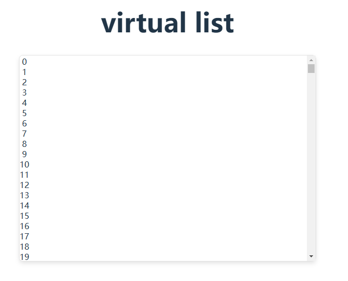

# Vue 3 Virtual List

This is a simple implementation of a virtual list component using Vue 3. The virtual list efficiently renders only the items that are in the visible area of the scrollable container, significantly improving performance when dealing with large datasets.



## Features

- Efficient rendering of large lists
- Smooth scrolling
- Dynamic item height support
- Easy to integrate and customize

## Usage

### Installation

```bash
pnpm install
```

### Development

```bash
pnpm run dev
```

### Production Build

```bash
pnpm run build
```

### Contributing

Contributions are welcome! Please follow the contributing guidelines to submit improvements or fixes.

### License

This project is licensed under the MIT License. See the LICENSE file for details.
